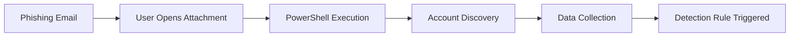

# Threat Detection Assessment Lab

This project demonstrates threat emulation, attack chain analysis, detection engineering, and security documentation using MITRE ATT&CK methodologies.

## Skills Demonstrated

- Threat Emulation
- MITRE ATT&CK Mapping
- Detection Engineering
- Security Analysis
- Incident Response
- Security Documentation

## Technologies & Frameworks

- MITRE ATT&CK
- Sigma Rules
- Windows Event Analysis
- Threat Detection Concepts
- Security Operations

## Repository Structure

attack-notes/
detection-notes/
detection-rules/
documentation/
screenshots/

## Threat Emulation Workflow

